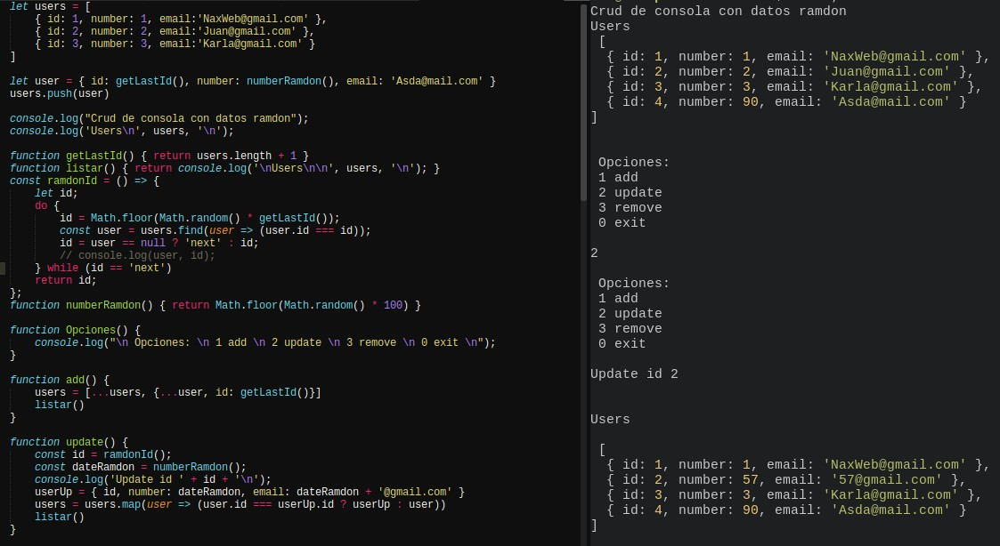

# javascript #nodejs #consola

Crud de js por consola

### comands

	node crud
	node crudConsole

## Github 📌

Uso [GIT](https://git-scm.com/) para control de versiones.
Puedes ver los comandos que uso [aqui](https://nacholabraweb.000webhostapp.com/Tutoriales/#/Github)

Agradecimientos a github por tener este proyecto en la nube.

## Licencia 📄

Este proyecto está bajo la Licencia (MIT)
App desarrollada por Ignacio Labra
